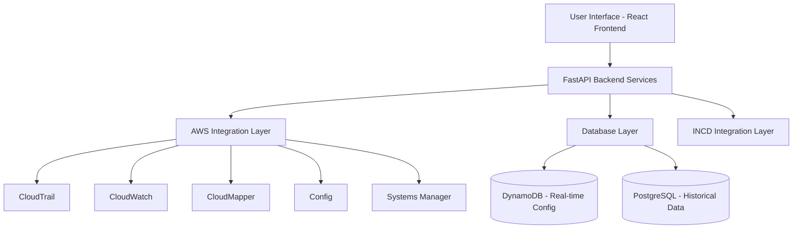
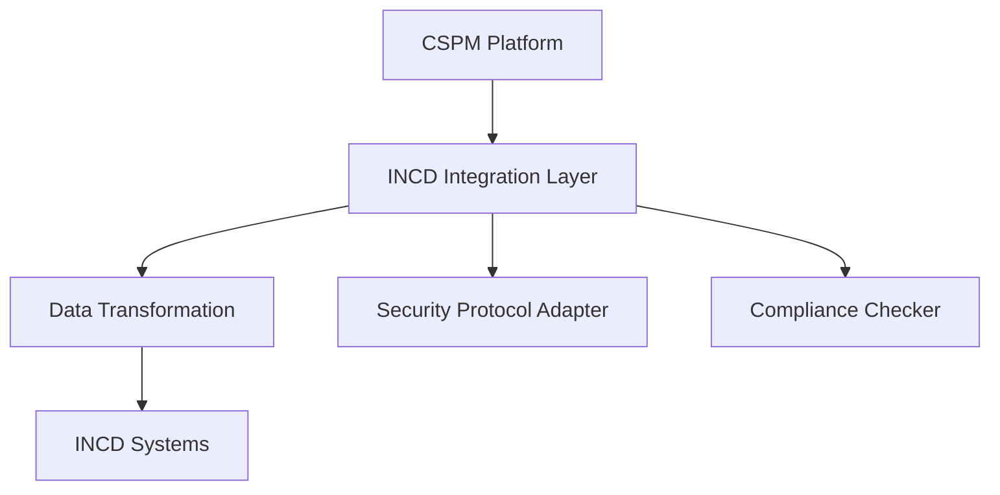

# Detailed-Design
# AWS Security Platform (CSPM) - Detailed Design Document

## 1. System Architecture

### 1.1 High-Level Architecture



### 1.2 Component Overview

#### Frontend Layer (React)
- Security Dashboard
- Interactive Visualizations
- Alert Management Interface
- Responsive Design Components

#### Backend Services (Python/FastAPI)
- REST API with JWT Authentication
- RBAC Implementation
- Security Scanning Service
- Real-time Log Collection
- Agent Management System

#### AWS Integration Layer
- CloudTrail Integration for Audit
- CloudWatch for Monitoring
- CloudMapper for Network Analysis
- Config for Resource Tracking
- Systems Manager for Deployment

## 2. Core Functionality Design

### 2.1 IAM Role Mapping & Permission Analysis

```python
class IAMAnalyzer:
    def __init__(self, aws_session):
        self.iam_client = aws_session.client('iam')
        self.analyzer = RoleAnalyzer()
        
    async def analyze_permissions(self):
        roles = await self.get_all_roles()
        return self.analyzer.identify_risks(roles)
        
    def identify_excessive_permissions(self, role_policies):
        # Implementation for identifying over-privileged roles
        pass
```

### 2.2 Cloud Instance Scanning

```python
class InstanceScanner:
    def __init__(self, aws_session):
        self.ec2_client = aws_session.client('ec2')
        self.config_client = aws_session.client('config')
        
    async def scan_instances(self):
        instances = await self.get_active_instances()
        configurations = await self.get_instance_configs()
        return self.analyze_security_posture(instances, configurations)
```

### 2.3 Log Collection & Analysis

```python
class LogAnalyzer:
    def __init__(self, aws_session):
        self.cloudwatch = aws_session.client('cloudwatch')
        self.cloudtrail = aws_session.client('cloudtrail')
        
    async def collect_security_logs(self, timeframe):
        logs = await self.fetch_logs(timeframe)
        return self.analyze_for_anomalies(logs)
```

## 3. Database Schema Design

### 3.1 DynamoDB Schema (Real-time Configuration)

```json
{
  "SecurityConfig": {
    "pk": "CONFIG#<resource_id>",
    "sk": "STATUS#<timestamp>",
    "resourceType": "string",
    "currentStatus": "string",
    "securityScore": "number",
    "lastScan": "timestamp"
  },
  "ActiveAlerts": {
    "pk": "ALERT#<alert_id>",
    "sk": "RESOURCE#<resource_id>",
    "severity": "string",
    "detectionTime": "timestamp",
    "status": "string"
  }
}
```

### 3.2 PostgreSQL Schema (Historical Data)

```sql
CREATE TABLE security_events (
    id SERIAL PRIMARY KEY,
    event_time TIMESTAMP,
    resource_id VARCHAR(100),
    event_type VARCHAR(50),
    severity LEVEL,
    details JSONB,
    resolution_status VARCHAR(20)
);

CREATE TABLE compliance_history (
    id SERIAL PRIMARY KEY,
    resource_id VARCHAR(100),
    check_timestamp TIMESTAMP,
    compliance_status VARCHAR(20),
    violations JSONB
);
```

## 4. Implementation Details

### 4.1 Frontend Components

```typescript
// Security Dashboard Component
interface DashboardProps {
    securityScore: number;
    activeAlerts: Alert[];
    resourceStats: ResourceMetrics;
}

// Resource Scanner Component
interface ScannerProps {
    onScanInitiate: () => Promise<void>;
    scanStatus: ScanStatus;
    results: ScanResults;
}
```

### 4.2 API Endpoints

```yaml
openapi: 3.0.0
paths:
  /api/v1/scan:
    post:
      summary: Initiate security scan
      parameters:
        - name: scanType
          in: query
          required: true
          schema:
            type: string
            enum: [full, quick, targeted]
            
  /api/v1/resources:
    get:
      summary: Get resource inventory
      parameters:
        - name: resourceType
          in: query
          schema:
            type: string
```

## 5. Security Features

### 5.1 Anomaly Detection System

```python
class AnomalyDetector:
    def __init__(self):
        self.ml_model = self.load_model()
        
    def analyze_logs(self, log_data):
        patterns = self.extract_patterns(log_data)
        return self.detect_anomalies(patterns)
        
    def detect_anomalies(self, patterns):
        # Implementation of anomaly detection logic
        pass
```

### 5.2 Rule-Based Security Engine

```python
class SecurityRuleEngine:
    def __init__(self):
        self.rules = self.load_security_rules()
        
    def evaluate_resource(self, resource_config):
        violations = []
        for rule in self.rules:
            if not rule.check_compliance(resource_config):
                violations.append(rule.get_violation_details())
        return violations
```

## 6. INCD Integration

### 6.1 Integration Architecture



### 6.2 Compliance Implementation

```python
class INCDCompliance:
    def __init__(self):
        self.requirements = self.load_incd_requirements()
        
    def validate_security_posture(self, system_state):
        compliance_status = {}
        for req in self.requirements:
            status = req.check_compliance(system_state)
            compliance_status[req.id] = status
        return compliance_status
```

## 7. Cost Optimization Features

### 7.1 Resource Efficiency

```python
class ResourceOptimizer:
    def analyze_usage_patterns(self, resource_metrics):
        # Implementation for identifying cost-saving opportunities
        pass
        
    def recommend_optimizations(self, usage_patterns):
        return {
            'unused_resources': self.find_unused_resources(),
            'scaling_opportunities': self.identify_scaling_options(),
            'cost_projections': self.calculate_savings()
        }
```

## 8. Testing Strategy

### 8.1 Security Testing

```python
class SecurityTester:
    async def test_security_controls(self):
        await self.test_iam_controls()
        await self.test_resource_security()
        await self.test_log_collection()
        
    async def test_iam_controls(self):
        # Implementation of IAM security testing
        pass
```

### 8.2 Integration Testing

```python
class IntegrationTester:
    async def test_aws_integration(self):
        # Test AWS service connections
        pass
        
    async def test_incd_integration(self):
        # Test INCD system integration
        pass
```

## 9. Deployment Architecture

### 9.1 AWS Infrastructure

```yaml
Resources:
  ApiGateway:
    Type: AWS::ApiGateway::RestApi
    Properties:
      Name: CSPMApi
      Description: API for CSPM Platform
      
  DynamoDBTable:
    Type: AWS::DynamoDB::Table
    Properties:
      BillingMode: PAY_PER_REQUEST
      AttributeDefinitions:
        - AttributeName: pk
          AttributeType: S
        - AttributeName: sk
          AttributeType: S
```

### 9.2 CI/CD Pipeline

```yaml
version: 2.1
jobs:
  build:
    docker:
      - image: python:3.9
    steps:
      - checkout
      - run:
          name: Install Dependencies
          command: pip install -r requirements.txt
      - run:
          name: Run Tests
          command: pytest
```
