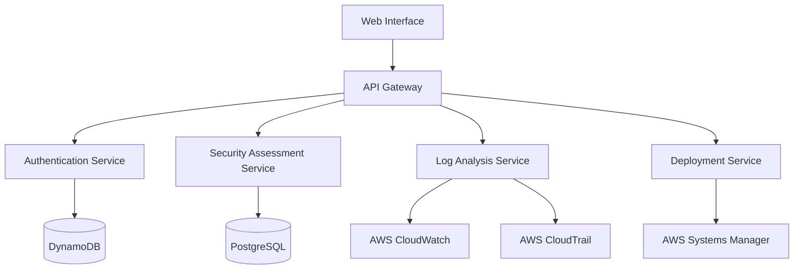
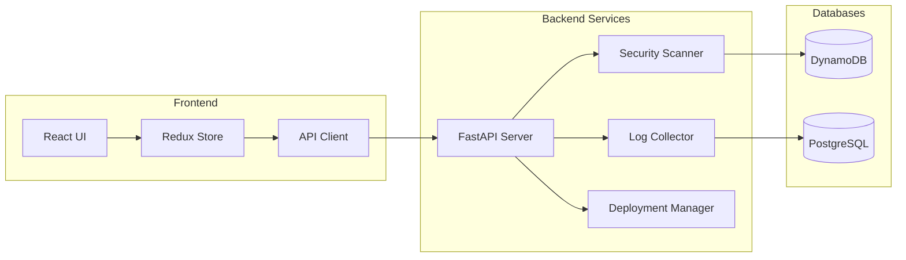

# Detailed-Design

# AWS Security Platform (CSPM) - Detailed Design Document

## 1. System Architecture

### 1.1 High-Level Architecture



### 1.2 Component Diagram



## 2. Detailed Component Design

### 2.1 Frontend Components

#### Dashboard Component
```typescript
interface DashboardProps {
    securityScore: number;
    recentAlerts: Alert[];
    resourceCount: ResourceMetrics;
    loading: boolean;
}

interface Alert {
    id: string;
    severity: 'high' | 'medium' | 'low';
    message: string;
    timestamp: Date;
    resourceId: string;
}

interface ResourceMetrics {
    totalInstances: number;
    activeInstances: number;
    securityGroups: number;
    iamRoles: number;
}
```

#### Security Scanner Component
```typescript
interface ScannerProps {
    onScanComplete: (results: ScanResults) => void;
    scanStatus: ScanStatus;
    lastScanTime: Date;
}

type ScanStatus = 'idle' | 'scanning' | 'complete' | 'error';

interface ScanResults {
    vulnerabilities: Vulnerability[];
    misconfigurations: Misconfiguration[];
    timestamp: Date;
}
```

### 2.2 Backend Services

#### Security Assessment Service
```python
class SecurityAssessment:
    def __init__(self, aws_credentials: AWSCredentials):
        self.aws_client = AWSClient(aws_credentials)
        self.scanner = SecurityScanner()
        self.reporter = ReportGenerator()
    
    async def perform_assessment(self, config: ScanConfig) -> AssessmentResult:
        raw_data = await self.aws_client.collect_resource_data()
        scan_results = self.scanner.analyze_resources(raw_data)
        return self.reporter.generate_report(scan_results)

class SecurityScanner:
    def analyze_resources(self, data: ResourceData) -> ScanResults:
        # Implementation details
        pass
```

#### Log Analysis Service
```python
class LogAnalyzer:
    def __init__(self):
        self.cloudwatch = CloudWatchClient()
        self.cloudtrail = CloudTrailClient()
        
    async def collect_logs(self, timeframe: TimeFrame) -> LogCollection:
        cloudwatch_logs = await self.cloudwatch.get_logs(timeframe)
        cloudtrail_logs = await self.cloudtrail.get_logs(timeframe)
        return self.merge_logs(cloudwatch_logs, cloudtrail_logs)
```

## 3. Database Schema Design

### 3.1 DynamoDB Schema

```json
{
  "Users": {
    "pk": "USER#<user_id>",
    "sk": "METADATA#<timestamp>",
    "email": "string",
    "role": "string",
    "permissions": "set<string>",
    "lastLogin": "timestamp"
  },
  "SecurityScans": {
    "pk": "SCAN#<scan_id>",
    "sk": "RESULT#<timestamp>",
    "status": "string",
    "findings": "list<map>",
    "resourcesScanned": "number"
  }
}
```

### 3.2 PostgreSQL Schema

```sql
CREATE TABLE security_events (
    id SERIAL PRIMARY KEY,
    event_time TIMESTAMP,
    event_type VARCHAR(50),
    severity VARCHAR(20),
    resource_id VARCHAR(100),
    details JSONB
);

CREATE TABLE resource_inventory (
    id SERIAL PRIMARY KEY,
    aws_resource_id VARCHAR(100),
    resource_type VARCHAR(50),
    creation_date TIMESTAMP,
    last_modified TIMESTAMP,
    configuration JSONB
);
```

## 4. API Specification

### 4.1 REST API Endpoints

#### Security Assessment API
```yaml
openapi: 3.0.0
paths:
  /api/v1/scans:
    post:
      summary: Initiate a security scan
      requestBody:
        content:
          application/json:
            schema:
              type: object
              properties:
                scanType:
                  type: string
                  enum: [full, quick, custom]
      responses:
        '202':
          description: Scan initiated
          content:
            application/json:
              schema:
                type: object
                properties:
                  scanId:
                    type: string
                  estimatedDuration:
                    type: integer
```

#### Log Management API
```yaml
  /api/v1/logs:
    get:
      summary: Retrieve security logs
      parameters:
        - name: startTime
          in: query
          required: true
          schema:
            type: string
            format: date-time
        - name: endTime
          in: query
          required: true
          schema:
            type: string
            format: date-time
      responses:
        '200':
          description: Logs retrieved successfully
```

## 5. Design Patterns

### 5.1 Observer Pattern
Used for real-time updates of security events:

```typescript
interface SecurityEventObserver {
    update(event: SecurityEvent): void;
}

class SecurityEventSubject {
    private observers: SecurityEventObserver[] = [];
    
    attach(observer: SecurityEventObserver): void {
        this.observers.push(observer);
    }
    
    notify(event: SecurityEvent): void {
        this.observers.forEach(observer => observer.update(event));
    }
}
```

### 5.2 Factory Pattern
For creating different types of security scanners:

```python
class ScannerFactory:
    @staticmethod
    def create_scanner(scanner_type: str) -> BaseScanner:
        if scanner_type == "vulnerability":
            return VulnerabilityScanner()
        elif scanner_type == "compliance":
            return ComplianceScanner()
        elif scanner_type == "iam":
            return IAMScanner()
        raise ValueError(f"Unknown scanner type: {scanner_type}")
```

## 6. Interface Design and Prototypes

### 6.1 Dashboard Layout
```typescript
const DashboardLayout = styled.div`
    display: grid;
    grid-template-columns: repeat(12, 1fr);
    gap: 1rem;
    padding: 1rem;
    
    @media (max-width: 768px) {
        grid-template-columns: 1fr;
    }
`;

const SecurityScoreCard = styled.div`
    grid-column: span 4;
    background: white;
    border-radius: 8px;
    padding: 1rem;
    box-shadow: 0 2px 4px rgba(0,0,0,0.1);
`;
```

### 6.2 Component Hierarchy
```
App
├── Navigation
├── Dashboard
│   ├── SecurityScore
│   ├── AlertList
│   └── ResourceOverview
├── SecurityScanner
│   ├── ScanControls
│   └── ResultsViewer
└── Settings
    ├── UserManagement
    └── AWSConfiguration
```

## 7. Modular Decomposition

### 7.1 Core Modules
- Authentication Module
- Security Assessment Module
- Log Analysis Module
- Deployment Module
- Reporting Module

### 7.2 Module Interfaces

```typescript
interface SecurityAssessmentModule {
    startScan(config: ScanConfig): Promise<ScanJob>;
    getScanStatus(jobId: string): Promise<ScanStatus>;
    getScanResults(jobId: string): Promise<ScanResults>;
}

interface LogAnalysisModule {
    startLogCollection(config: LogConfig): Promise<void>;
    queryLogs(query: LogQuery): Promise<LogResults>;
    exportLogs(format: ExportFormat): Promise<ExportJob>;
}
```

## 8. Testing Strategy

### 8.1 Unit Tests
```python
def test_security_scanner():
    scanner = SecurityScanner()
    mock_data = generate_mock_resource_data()
    results = scanner.analyze_resources(mock_data)
    assert results.vulnerability_count > 0
    assert results.status == "completed"
```

### 8.2 Integration Tests
```python
async def test_end_to_end_scan():
    client = TestClient(app)
    response = client.post("/api/v1/scans", json={"scanType": "full"})
    assert response.status_code == 202
    scan_id = response.json()["scanId"]
    
    # Poll for completion
    while True:
        status = client.get(f"/api/v1/scans/{scan_id}/status")
        if status.json()["status"] == "completed":
            break
        await asyncio.sleep(1)
```

## 9. Deployment Architecture

### 9.1 AWS Infrastructure
```yaml
Resources:
  ApiGateway:
    Type: AWS::ApiGateway::RestApi
    Properties:
      Name: CSPMApi
      
  LambdaFunction:
    Type: AWS::Lambda::Function
    Properties:
      Runtime: python3.9
      Handler: index.handler
      Code:
        S3Bucket: !Ref DeploymentBucket
        S3Key: lambda.zip
```

### 9.2 Containerization
```dockerfile
FROM python:3.9-slim

WORKDIR /app
COPY requirements.txt .
RUN pip install -r requirements.txt

COPY . .
CMD ["uvicorn", "main:app", "--host", "0.0.0.0", "--port", "8000"]
```
